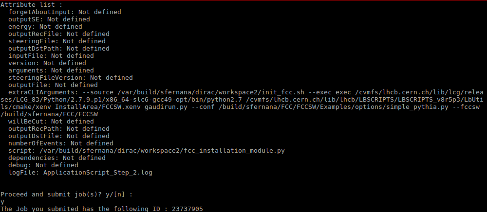

# Getting Started with FCCDIRAC


Contents:

  * [FCCDIRAC](#fccdirac)
    * [Overview](#overview)
    * [1 - Existing Infrastructure](#1---existing-infrastructure)
      * [a - Grid philosophy](#a---grid-philosophy)
      * [b - DIRAC](#b---dirac)
    * [2 - FCCDIRAC](#2---fccdirac)
      * [a - Objective of this repository](#a---objective-of-this-repository)
      * [b - Workflow](#b---workflow)
    * [3 - Prerequisites](#3---prerequisites)
      * [a - GRID access](#a---grid-access)
      * [b - Setting up ILCDIRAC environment](#b---setting-up-ilcdirac-environment)
    * [4 - FCCDIRAC Installation](#4---fccdirac-installation)
    * [5 - Examples](#5---examples)
      * [a - Simple FCC job](#a---simple-fcc-job)
      * [b - Complex FCC Job](#b---complex-fcc-job)
    * [6 - Get Back Results](#6---get-back-results)
      * [a - Command Line Interface](#a---command-line-interface)
      * [b - Web Portal](#b---web-portal)


## Overview


## 1 - Existing Infrastructure


### a - Grid philosophy

The amount of data generated by the LHC (Large Hadron Collider) show that it is very unlikely that one scientific 
center may scope in managing data because of computing resources required by such applications.

Indeed, to give you a figure, LHC generated about 50 Petabytes in 2016 and the solution was to distribute data over many centers.
That's the prurpose of the creation of the WLCG (Worldwide LHC Computing Grid) which is a global collaboration of more than 170 computing centers in 42 countries, 
linking up national and international grid infrastructures.

In this way, WLCG offers the following advantages :

- Replication of data
- Access data by everyone from anywhere
- Backups between different sites 


WLCG is the world's largest computing Grid and it is based on two main Grids which are EGI (the European Grid Infrastructure) in Europe, and OSG (the Open Science Grid) in the US.

Apart from the fact that 10 000 scientists are working on the four main experiments ALICE, ATLAS, CMS and LHCb , authorized users can access the Grid and run their own job thanks to the 'Middlewares'.


### b - DIRAC

DIRAC (Distributed Infrastructure with Remote Agent Control) INTERWARE is a software framework for distributed computing providing a complete solution to people requiring access to
a Grid. 

DIRAC project was initially developed for the LHCb Collaboration and became a general-purpose Grid Middleware.

DIRAC builds a layer between the users and the resources offering a homogeneous interface to an heterogeneous set of computing resources (Middlewares, VMs,laptops,...). 
It is now used by several communities (more than 20 Virtual Organizations e.g. LHCb, Belle etc...).

FCC choose to use DIRAC because of its many benefits (Non-exhaustive list) :

- Workload Management
- Transformations
- Monitoring
- Accounting
- Security (DISET)
- BookKeeping
- Webportal (a Friendly Web interface to monitor your jobs)


## 2 - FCCDIRAC

### a - Objective of this repository

Before using DIRAC, you need to fullfill the prerequisites. This repository is a set of python scripts that permit you to submit a job without reading the documentation of DIRAC.
It aims to offer you the more intuitive way to run FCC software on the Grid by hiding the DIRAC machinery as much as possible.

At the end of this tutorial, you will be able from your seat to run a job on a machine located at the other side of the planet without paying attention about **WHERE** or **HOW** it works,
all this thanks to the GRID infrastructure and Abstraction layer built by DIRAC.


### b - Workflow


## 3 - Prerequisites


### a - GRID access

First, to be authorized to use the GRID, you need to have :
 
- a GRID certificate 


Second, to be able to submit jobs through DIRAC interware, in general you need :

- to join a VO (Virtual Organization) which has already set up on their servers an instance of DIRAC for its members


Instructions for these 2 primordial steps can be found here :

- [LHCB tutorial](https://twiki.cern.ch/twiki/bin/view/LHCb/FAQ/Certificate)

or here :

- [CLIC tutorial](https://twiki.cern.ch/twiki/bin/view/CLIC/IlcdiracRegistration)


Actually, FCC group does not have its own VO. After Discussion with CLIC people, they authorized some FCC people to join their VO, for which we are very grateful.


So, in the next section, the instuctions of the client installation are specifc to ILC VO.


If you encounter some problems with the client installation, very good tutorials are also available here :


[DIRACGrid tutorial](https://github.com/DIRACGrid/DIRAC/wiki/DIRAC-Tutorials)

or here :

[LCD tutorial](http://lcd-data.web.cern.ch/lcd-data/doc/HeadFirstTalk.pdf)


### b - Setting up ILCDIRAC environment

IlcDirac is  an  extension  of  the DIRAC framework, it is  built  on  top  of  the  workflow  API  from Dirac. 

ILCDirac offers a set of applications used  in  the  LC  community and there 14  that are  currently  supported  natively by ILCDirac. 

Among  them  are  :

-	SLIC and Mokka (detector  simulation  frameworks  based  on Geant4)
-	Marlin and org.lcsim (reconstruction and analysis frameworks)
-	Monte Carlo generators (Whizard,Pythia) and ROOT


Here are the minimum requirements if you want to continue this tutorial :

-	a computer running Linux  or MacOS X 
-	a working version of Python (v2.4 minimum)
-	to be able to install some software on your computer


So, as you understand, DIRAC works in client-server architecture.

ILCDIRAC servers are running somewhere while users submit their jobs through a client which relay data to the servers.

So, in order to submit jobs through ILCDIRAC, you need to get the ILCDIRAC client.

If you are a CERN user, ILCDIRAC client is already installed on AFS, you can follow the instructions here :

[CLIC twiki tutorial](https://twiki.cern.ch/twiki/bin/view/CLIC/IlcdiracEnvironment#Installing_ILCDIRAC)

Indeed, you only have to source a script and configure ILCDIRAC client using a proxy and your Grid certificate.

If you do not have access to CERN AFS, you can install ILCDIRAC client locally.

The following installation is scpecific to ILC VO but it is quite similar to the general procedure.
Installation scripts (e.g. **ilcdirac-install.sh**) and cfg files (e.g. **defaults-ILCDIRAC.cfg**) may differ according to your VO.


This client is composed of a set of commands that allow you to manage your jobs as well as your data.

ILCDIRAC client required your certificate in a specific format, you need to convert your GRID certificate from p12 format (as you exported it from your browser) to PEM format.

But don't worry, the client has already a tool for that :D (8th line of the bash script below).

It will store your converted certificate to your **.globus** directory.


Here are the instructions of how to install ILCDIRAC client and configure it with your GRID certificate (even the certificate conversion is included, no need to make it before):


```

#install client
mkdir -p $HOME/DIRAC
cd  $HOME/DIRAC
wget http://www.cern.ch/lcd-data/software/ilcdirac-install.sh
chmod +x ilcdirac-install.sh
./ilcdirac-install.sh
source bashrc
#conversion of the grid certificate from p12 to PEM files
dirac-cert-convert.sh /path/to/your_grid_certificate.p12
dirac-proxy-init -x
./scripts/dirac-configure defaults-ILCDIRAC.cfg
dirac-proxy-init
cd ..

```

**ilcdirac-install.sh** will install ILCDIRAC client in your machine.

Replace **your_grid_certificate.p12** by your real certificate name.

The file **defaults-ILCDIRAC.cfg** is specific to ILC and it is a configuration file which help users to configure DIRAC client according to the VO they are affiliated with.

Each VO using DIRAC should have such a file which helps their users to configure DIRAC client quickly.

If you are affiliated with a VO different from ILC, please refer to your VO DIRAC website or contact your VO administrator to get this files.
 


## 4 - FCCDIRAC Installation


```

mkdir -p $HOME/DIRAC/workspace
cd  $HOME/DIRAC/workspace
git clone https://github.com/sfernana/FCCDIRAC.git
cd FCCDIRAC
./fcc_user_submit.py

```


## 5 - Examples


Through the script [fcc_user_submit.py](https://github.com/sfernana/FCCDIRAC/blob/master/fcc_user_submit.py), we provide you a complete example of how to run FCC jobs on the Grid.

Let's go step by step with 2 examples.

With the 2 following examples, the user has to consider that there exist FCC jobs that may contain one or more applications.


### a - Simple FCC Job


In this simple example, we want to run **FCC PHYSICS** on the GRID.

```

#!/bin/env python

#************************** libraries importation **************************#

#user libraries
#importations of fcc core classes
from fcc_core import *

#standard libraries
import os

        
#1st FCC job
fcc = Job()

#we specify the source we script
#for now the same for each job
fcc.set_sourcing_script(os.path.join(os.getcwd(), "init_fcc.sh"))

#1st application of the 1st FCC job

#---------------FCC PHYSICS---------------------------------#
fcc_physics = Application()


fcc_physics.set_executable('fcc-pythia8-generate')
fcc_physics.set_configuration_file('/cvmfs/fcc.cern.ch/sw/0.7/fcc-physics/0.1/x86_64-slc6-gcc49-opt/share/ee_ZH_Zmumu_Hbb.txt')

#we add the application to the job
fcc.append(fcc_physics)

#finally, we can submit the 1st FCC job containing 2 applications in this case
fcc.submit()


```


### b - Complex FCC Job


Now, let us complicate things in adding a new application at our job that is the famous **FCCSW**.


```


#!/bin/env python

#************************** libraries importation **************************#

#user libraries
#importations of fcc core classes
from fcc_core import *

#standard libraries
import os

        
#1st FCC job
fcc = Job()

#we specify the source we script
#for the moment, the same for each job
fcc.set_sourcing_script(os.path.join(os.getcwd(), "init_fcc.sh"))

#1st application of the 1st FCC job

#---------------FCC PHYSICS---------------------------------#
fcc_physics = Application()


fcc_physics.set_executable('fcc-pythia8-generate')
fcc_physics.set_configuration_file('/cvmfs/fcc.cern.ch/sw/0.7/fcc-physics/0.1/x86_64-slc6-gcc49-opt/share/ee_ZH_Zmumu_Hbb.txt')

#we add the application to the job
fcc.append(fcc_physics)


#2nd application of the 1st FCC job

#---------------FCCSW---------------------------------#
fccsw = Application()


fccsw_path = '/build/<YOUR_USERNAME>/FCC/FCCSW'

#we test these 2 configurations succesfully
#conf_file = os.path.join(fccsw_path,'Examples/options/geant_pgun_fullsim.py')
conf_file = os.path.join(fccsw_path,'Examples/options/simple_pythia.py')

#stuff to call gaudirun.py
python = '/cvmfs/lhcb.cern.ch/lib/lcg/releases/LCG_83/Python/2.7.9.p1/x86_64-slc6-gcc49-opt/bin/python2.7'
xenv = '/cvmfs/lhcb.cern.ch/lib/lhcb/LBSCRIPTS/LBSCRIPTS_v8r5p3/LbUtils/cmake/xenv'
arg_xenv  = 'InstallArea/FCCSW.xenv'
exe = 'gaudirun.py'


fccsw.set_executable('exec ' + python + ' ' + xenv + ' ' + arg_xenv + ' ' + exe)
fccsw.set_configuration_file(conf_file)


fccsw.set_fccsw_path(fccsw_path)

#example of how to add 'extra' files or folders
#fccsw.add_paths(['/afs/cern.ch/user/<YOUR_INITIAL>/<YOUR_USERNAME>/foo.bar','/afs/cern.ch/user/<YOUR_INITIAL>/<YOUR_USERNAME>/HelloWorld'])

fcc.append(fccsw)

#finally, we can submit the 1st FCC job containing 2 applications in this case
fcc.submit()

```

In this example, we supposed that FCCSW folder is located at **/build/<YOUR_USERNAME>/FCC**.
If necessary, change it to make it point to your real FCCSW location.
 

## 6 - Get Back Results


After you called the script [fcc_user_submit.py](https://github.com/sfernana/FCCDIRAC/blob/master/fcc_user_submit.py), you have to confirm the submission to DIRAC and get a display similar to this one :




WARNING : Your results are not getting back to your submitted working directory when the job finished, they are stored :
	
-	in the DIRAC database if results are smaller than 10 MO
-	in the DIRAC catalog file if results are bigger than 10 MO

### a - Command Line Interface


How to check your job status :

	dirac-wms-job-status YOUR_JOB_ID


How to get back the output :

	dirac-wms-job-get-output YOUR_JOB_ID


### b - Web Portal


Here is the link to monitor ILCDIRAC jobs from the web. If you are not affiliated with ILC, please refer to your VO DIRAC website or contact your VO administrator to know your VO DIRAC web portal address.


https://ilcdirac.cern.ch/DIRAC/?view=tabs&theme=Grey&url_state=1|*DIRAC.FileCatalog.classes.FileCatalog:*DIRAC.JobMonitor.classes.JobMonitor:,


On the left side, click on 'Job Monitor' :


On the right side, click on 'refresh' :


Congratulations !!!

You ran FCC softwares on the GRID.

For any questions or any further informations, please contact us at : fcc-experiments-sw-devATSPAMNOTcern.ch
