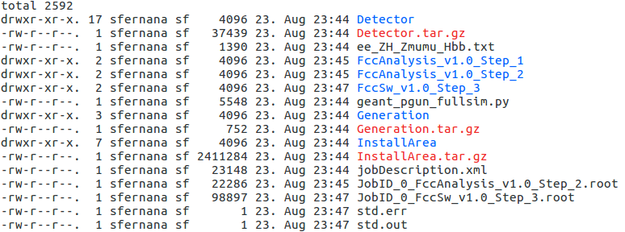
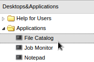
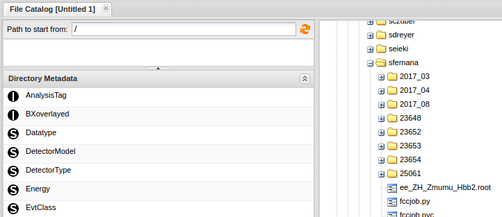
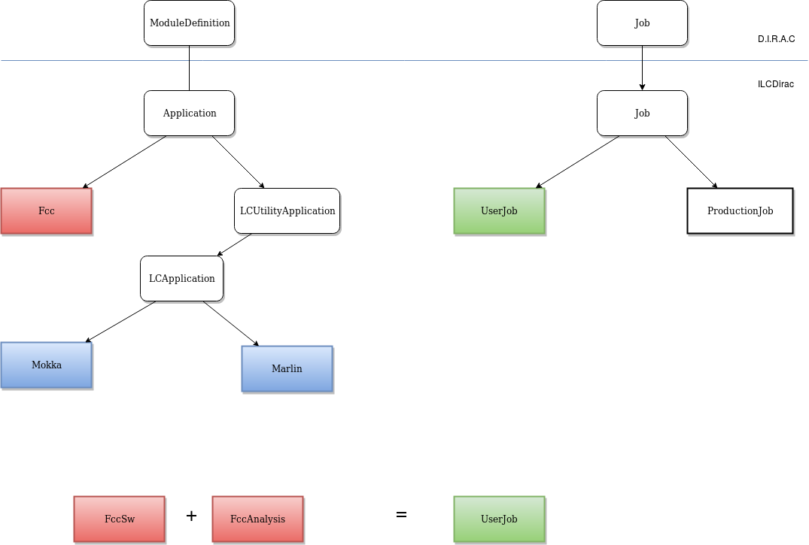
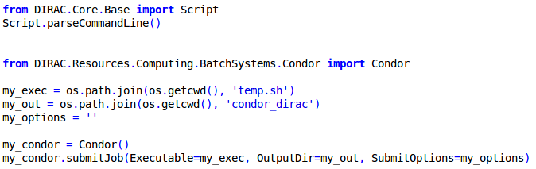

# Getting Started with DIRAC


Contents:

  * [DIRAC](#dirac)
    * [Overview](#overview)
    * [1 - Existing Infrastructure](#1---existing-infrastructure)
      * [a - Introduction](#a---introduction)
      * [b - DIRAC](#b---dirac)
    * [2 - FCC JOB](#2---fcc-job)
      * [a - Job](#a---job)
      * [b - Application](#b---application)
    * [3 - Prerequisites](#3---prerequisites)
      * [a - GRID access](#a---grid-access)
      * [b - Setting up ILCDIRAC environment](#b---setting-up-ilcdirac-environment)
    * [4 - Examples](#4---examples)
      * [a - Simple FCC job](#a---simple-fcc-job)
      * [b - Complex FCC Job](#b---complex-fcc-job)
    * [5 - Sandboxes & Data](#5---data)
      * [a - Output Data](#a---input-data)
      * [b - Input Data](#b---output-data)
    * [6 - Monitoring](#6---monitoring)
      * [a - Command Line Interface](#a---command-line-interface)
      * [b - Web Portal](#b---web-portal)
    * [7 - Advanced](#6---advanced)
      *	[a - Job splitting](#a---job-splitting)
      * [b - FCC integration](#b---fcc-integration)
      * [c - HTCondor submission with dirac](#c---htcondor-submission-with-dirac)
	


## Overview


## 1 - Existing Infrastructure


### a - Introduction

This tutorial is intented to people who want to run FCC jobs on the GRID.

GRID submission relies on GRID framework providing an intuitive user interface quite similar to BATCH submission.

This tutorial aims to show you how to use this interface in order to submit FCC jobs.

### b - DIRAC

DIRAC project was initially developed for the LHCb Collaboration and became a general-purpose Grid Middleware.

DIRAC builds a layer between the users and the resources offering a homogeneous interface to an heterogeneous set of computing resources (Middlewares, VMs,laptops,...). 

It is now used by several communities, more than 20 VOs (Virtual Organizations) e.g. CLIC, LHCb, Belle etc...

FCC group choose to use DIRAC because of its many benefits (Non-exhaustive list) :

- Workload Management
- Transformations
- Monitoring
- Accounting
- Security (DISET)
- BookKeeping
- Webportal (a Friendly Web interface to monitor your jobs)

DIRAC is VO oriented so generally, an instance of the DIRAC framework is managed by a VO e.g. :

- ILCDIRAC (managed by CLIC)
- LHCbDIRAC (managed by LHCb)

They manage DIRAC servers configuring for doing job scheduling, data bookkeeping etc...

Because it is too redundant to create a new instance of DIRAC for each VO, FCC group decided to collaborate with CLIC group.

So CLIC group is sharing ILCDIRAC with FCC group.

A multi VO installation is possible with DIRAC and it is a matter of server configuration.

For more informations, please look at :

[Multi VO installation](http://dirac.readthedocs.io/en/latest/AdministratorGuide/MultiVO/)

## 2 - FCC JOB

### a - JOB

Basic building blocks for specifying jobs are already present in DIRAC.

An other concept defined more or less by VOs is the Application concept.

An application can be considered as a step for a job.

We are used to know that jobs are simple executables running with input/output files. 

Thanks to this new concept, you can specify a job like a chain of applications or a succession of steps where each step can be an executable. 

It is also possible to have dependency between each step.

### a - Application

VOs have created many applications in their DIRAC instance with a specific purpose :

- Simulation
- Reconstruction
- Analysis
- etc...

Then a physics process is easy to define with DIRAC because we have the job representing the whole physics process and a step in the process (reconstruction or analysis) is represented by an Application.
 
Usually, users just have to "configure" the application, add user libraries if needed and submit the job.

Indeed applications are pre-defined (executable, parameters ...)

For FCC group, 2 applications have been designed :

- FccSw
- FccAnalysis

However in order to use them and submit a FCC job, you need to fullfill the prerequisites. 

## 3 - Prerequisites


### a - GRID access

First, to be authorized to use the GRID, you need to have :
 
- a GRID certificate 


Second, to be able to submit jobs through DIRAC interware, in general you need :

- to join a VO (Virtual Organization) which has already set up on their servers an instance of DIRAC for its members


Instructions for these 2 primordial steps can be found here :

- [CLIC tutorial](https://twiki.cern.ch/twiki/bin/view/CLIC/IlcdiracRegistration)

or here :

- [LHCB tutorial](https://twiki.cern.ch/twiki/bin/view/LHCb/FAQ/Certificate)


Because FCC group collaborate with CLIC group, new FCC users have to register to the CLIC VO.


So, in the next section, the instuctions of the client installation are specific to the CLIC VO.


If you encounter some problems with the client installation, very good tutorials are also available here :


[DIRACGrid tutorial](https://github.com/DIRACGrid/DIRAC/wiki/DIRAC-Tutorials)

or here :

[LCD tutorial](http://lcd-data.web.cern.ch/lcd-data/doc/HeadFirstTalk.pdf)


### b - Setting up ILCDIRAC environment

ILCDIRAC is  an  extension/instance of  the DIRAC framework, it is  built  on  top  of  the  workflow  API  from Dirac. 

ILCDIRAC offers a set of applications used in the LC community and 14 applications are  currently  supported  natively by ILCDIRAC. 

Among  them  are  :

-	SLIC and Mokka (detector  simulation  frameworks  based  on Geant4)
-	Marlin and org.lcsim (reconstruction and analysis frameworks)
-	Monte Carlo generators (Whizard,Pythia) and ROOT


Here are the minimum requirements if you want to continue this tutorial :

-	a computer running Linux  or MacOS X 
-	a working version of Python (v2.4 minimum)
-	to be able to install some software on your computer


As you guess, DIRAC works in client-server architecture.

ILCDIRAC servers are running somewhere while users submit their jobs through a local client which relays jobs to the servers.

At the end of this tutorial, you will be able from your seat to run a job on a machine located at the other side of the planet without paying attention about **WHERE** or **HOW** it works,
all this thanks to the GRID infrastructure and Abstraction layer built by DIRAC.

In order to use ILCDIRAC, you need first to get the ILCDIRAC client.

ILCDIRAC client is already installed on AFS/CVMFS, you can follow the instructions here :

[CLIC twiki tutorial](https://twiki.cern.ch/twiki/bin/view/CLIC/IlcdiracEnvironment#Using_a_pre_existing_installatio)

Indeed, you only have to source a script and configure ILCDIRAC client using a proxy and your Grid certificate.

If you do not have access to AFS neither CVMFS, you can install ILCDIRAC client locally.

The following installation is scpecific to ILC VO but it is quite similar to the general procedure.
Installation scripts (e.g. **ilcdirac-install.sh**) and cfg files (e.g. **defaults-ILCDIRAC.cfg**) may differ according to your VO.


This client is composed of a set of commands that allow you to manage your jobs as well as your data.

ILCDIRAC client requires your certificate in a specific format, you need to convert your GRID certificate from p12 format (as you exported it from your browser) to PEM format.

But don't worry, the client has already a tool for that :D (dirac-cert-convert.sh).

It will store your converted certificate to your **.globus** directory.


Here are the instructions of how to install ILCDIRAC client and configure it with your GRID certificate (even the certificate conversion is included, no need to make it before):

If you want to use the pre existing installation and skip step 1, execute step 22 instead of step 2.


```

#1) install client
mkdir -p $HOME/DIRAC
cd  $HOME/DIRAC
wget http://www.cern.ch/lcd-data/software/ilcdirac-install.sh
chmod +x ilcdirac-install.sh
./ilcdirac-install.sh

#2) set ILCDIRAC environment of your client
source bashrc

#22) set ILCDIRAC environment of the pre client
#source /afs/cern.ch/eng/clic/software/DIRAC/bashrc

#3) set GRID user proxy
# conversion of the grid certificate from p12 to PEM files
dirac-cert-convert.sh /path/to/your_grid_certificate.p12
dirac-proxy-init -x
dirac-configure defaults-ILCDIRAC.cfg
dirac-proxy-init
cd ..

```

**ilcdirac-install.sh** will install ILCDIRAC client in your machine.

Replace **your_grid_certificate.p12** by your real certificate name.

The file **defaults-ILCDIRAC.cfg** is specific to ILC and it is a configuration file which help users to configure DIRAC client according to the VO they are affiliated with.

Each VO using DIRAC should have such a file which helps their users to configure DIRAC client quickly.

If you are affiliated with a VO different from ILC, please refer to your VO DIRAC website or contact your VO administrator to get this file.
 
## 4 - Examples


Let's go step by step with 2 examples.

With the 2 following examples, the user has to consider that there exist a "UserJob" (inheriting from DIRAC Job) that may contain one or several applications.


### a - Simple FCC Job


In this simple example, we want to run **FCCSW** on the GRID.

```

from DIRAC.Core.Base import Script
Script.parseCommandLine()

from ILCDIRAC.Interfaces.API.DiracILC import DiracILC
from ILCDIRAC.Interfaces.API.NewInterface.UserJob import UserJob
from ILCDIRAC.Interfaces.API.NewInterface.Applications import FccSw, FccAnalysis

ILC = DiracILC()

# job settings for a user job
job = UserJob()
job.setJobGroup("FCC")
job.setName("FccSW")
job.setPlatform('x86_64-slc5-gcc43-opt')
# e.g. ALWAYS, INFO, VERBOSE, WARN, DEBUG
job.setLogLevel('DEBUG')

job.setOutputSandbox(["*.log","*.root"])

#1st FCC application
FCC_SW = FccSw(
    fccConfFile='/build/YOUR_USERNAME/FCC/FCCSW/Examples/options/geant_pgun_fullsim.py',
    fccSwPath='/build/YOUR_USERNAME/FCC/FCCSW',
)

FCC_SW.logLevel = 'DEBUG'
#FCC_SW.numberOfEvents = 2
#FCC_SW.setOutputFile("output.root")

#applications appending ...
job.append(FCC_SW)

job.setOutputData('output.root')

job.submit(ILC,mode='wms')


```

In this example, FCCSW installation is located at **/build/&lt;YOUR_USERNAME&gt;/FCC**.
If necessary, change it to make it point to your real FCCSW location.
 
You can also use FCCSW installation of CVMFS but ensure that your configuration file does not use extra files that are not present in CVMFS else a beautiful error message will be printed !


### b - Complex FCC Job


Now, let us complicate things in doing chaining between **FCC Analysis** applications !

The first application generates events with **fcc-pythia8-generate** (the default executable of FccAnalysis) and the given card file **ee_ZH_Zmumu_Hbb.txt**.

The second application reads these events. 


```


from DIRAC.Core.Base import Script
Script.parseCommandLine()

from ILCDIRAC.Interfaces.API.DiracILC import DiracILC
from ILCDIRAC.Interfaces.API.NewInterface.UserJob import UserJob
from ILCDIRAC.Interfaces.API.NewInterface.Applications import FccSw, FccAnalysis

ILC = DiracILC()

# job settings for a user job
job = UserJob()
job.setJobGroup("FCC")
job.setName("Fcc Chain")
job.setPlatform('x86_64-slc5-gcc43-opt')
# e.g. ALWAYS, INFO, VERBOSE, WARN, DEBUG
job.setLogLevel('DEBUG')

job.setOutputSandbox(["*.log","*.root"])

#1st FCC application
FCC_PHYSICS1 = FccAnalysis(
    fccConfFile='/cvmfs/fcc.cern.ch/sw/0.8.1/fcc-physics/0.2.1/x86_64-slc6-gcc62-opt/share/ee_ZH_Zmumu_Hbb.txt'
)

#2nd FCC application
FCC_PHYSICS2 = FccAnalysis(
    executable='fcc-physics-read'
)

FCC_PHYSICS2.getInputFromApp(FCC_PHYSICS1)

#applications appending ...
job.append(FCC_PHYSICS1)
job.append(FCC_PHYSICS2)

job.setOutputData('ee_ZH_Zmumu_Hbb.root')

job.submit(ILC,mode='wms')

```

We provided you a more complete example here [fcc_user_submit.py](https://github.com/sfernana/FCCDIRAC/blob/master/fcc_user_submit.py).

You should get a display similar to this one :


Notice that these examples are submitting to the grid, you can also submit to your local machine by changing the mode like this :

	job.submit(ILC,mode='local')

## 5 - Sandboxes & Data

On the worker node (the machine executing the job), results should be organised like this :




A folder is created for the job and a subfolder is created for each application :

**FccAnalysis_v1.0_Step_1**

**FccAnalysis_v1.0_Step_2**

**FccSw_v1.0_Step_3**

By default, log file name, application script name and output file name follow this convention :

JobID_ID_APPLICATIONNAME_APPLICATIONVERSION_APPLICATIONSTEP**.**(log, root or sh)

### a - Sandboxes

There exist actually 2 sandboxes, one for the input files and the other one for the output files and they are used to upload or download files the job may consume or produce.
Generally, we put here "small" files.

The input sandox is uploaded with the job to the worker node.

How to set the input sandbox :

	job.setInputSandbox('my_input_file')

Notice that you can also specify a list for the input files.

The output sandbox is uploaded to the DIRAC database.

How to set the output sandbox :

	job.setOutputSandbox('my_input_file')

Notice that you can also specify a list for the output files.

WARNING : Your results are not getting back to your local machine when the job is finished, they are stored :
	
-	in the DIRAC database if results are smaller than 10 Mb
-	in the DIRAC File Catalog if results are bigger than 10 Mb

You have to use a specific command if you want to download the output sandbox (see [Monitoring section](#6---monitoring)).

### b - Data

### a - Output Data


Files **produced** by the job are known as **Output Data** that can be specified like this :

	job.setOutputData(lfns = "my_root_file.root", OutputPath = "Simulation", OuptutSE = "CERN-DST-EOS")

Notice that you can also specify a list for the output data.

You can specify the ouptut file name you want to store permanently in the storage of your choice (e.g. CERN EOS resources).

**my_root_file.root** has to be generated by the job else an error will be araised.

Here is the workflow of outputing data :

First the file **my_root_file.root** is registered to the DIRAC File Catalog with a LFN (Logical File Name) :

	/ilc/user/u/username/Simulation/my_root_file.root

As DIRAC is VO oriented, its components like the File Catalog is VO oriented as well.

So this LFN is choosen by the system, it takes the VO name followed by the initial and the username.

You can only specify a subpath which is the OuputPath e.g. : "Simulation"

Finally the file will be uploaded to these physical locations :

For **Castor** :

	/castor/cern.ch/grid

For **EOS** :

	/eos/experiment/clicdp/grid

For our case, it will be :

	/eos/experiment/clicdp/grid/ilc/user/u/username/Simulation/my_root_file.root

Precisely, these are the StorageElements used by the File Catalog which are VO specific.

So once the FCC VO will be created (if it is not yet the case), these physical locations will change and specified into :

**Resources/StorageElements** section of the **dirac.cfg** file used by the DIRAC configuration service on the server.

### b - Input Data

Files **consumed** by the job are known as **Input Data** that can specified like this :

	job.setInputData("/ilc/user/u/username/my_root_file.root")

Notice that you can also specify a list for the input data.

In specifying file by its LFN, it will look for this input data into the File Catalog then upload it with the job from the closest site (e.g. CERN).

Notice that data can have replicas in different sites.

## 6 - Monitoring

### a - CLI


How to check your job status :

	dirac-wms-job-status YOUR_JOB_ID


How to get back the output :

	dirac-wms-job-get-output YOUR_JOB_ID

How to browse the File Catalog :

	dirac-dms-filecatalog-cli

Basic operations on the File Catalog can be found here :

[DIRAC File Catalog tutorial](https://github.com/DIRACGrid/DIRAC/wiki/FileCatalog)


### b - Web Portal


Here is the link to monitor ILCDIRAC jobs and data from the web. If you are not affiliated with ILC, please refer to your VO DIRAC website or contact your VO administrator to know your VO DIRAC web portal address.


https://ilcdirac.cern.ch/DIRAC/?view=tabs&theme=Grey&url_state=1|*DIRAC.FileCatalog.classes.FileCatalog:*DIRAC.JobMonitor.classes.JobMonitor:,


On the left side, click on **Job Monitor** :


On the right side, click on 'refresh' :


By right-clicking on the job id, you can download logs and sandboxes.


On the left side, click on **File Catalog** :




On the right side, browse your file by looking for its LFN :




**Congratulations !!!**

You ran FCC Jobs on the GRID.

DIRAC is a powerfull framework and we decided to show you here only some basic functionalities.

Notice that we are using user jobs (UserJob) and it could interesting to test production jobs (ProductionJob) with FCC applications for people interested in doing productions.

## 7 - Advanced


### a - Job Splitting

Bulk submission is natively implemented in the DIRAC Job.

In designing Fcc Applications, we introduced a simplified interface for job spliting to make your life easier :) 

How to send 2 jobs with each a number of events of 4 :

	job.setSplitEvents(numberOfJobs = 2, eventsPerJob = 4) 

How to send 2 jobs with a total number of events of 5 (it will compute 3 events for the 1st job and 2 events for the second) :

	job.setSplitEvents(numberOfJobs = 2, totalNumberOfEvents = 5)

How to send a set of input data per job :

	job.setSplitInputData(['/ilc/user/u/username/data1.root','/ilc/user/u/username/data2.root','/ilc/user/u/username/data3.root'], NUMBER_OF_DATA_PER_JOB)

The setting of the event and the seed is automatically set by :

- appending another configuration file to GAUDI for FccSw (for the seed, the default random generator used is : **HepRndm::Engine&lt;CLHEP::RanluxEngine&gt;**)
- overwritting card files for Pythia

### b - FCC integration



### c - HTCondor submission with DIRAC

Dirac proposes also python interfaces for Condor, LSF and others BATCH systems to submit jobs to local BATCH system.



Notice that, there exist already a python API for HTCondor but at this day, submission is not possible until next next release of HTCondor.


For any questions or any further informations, please contact us at : fcc-experiments-sw-devATSPAMNOTcern.ch
